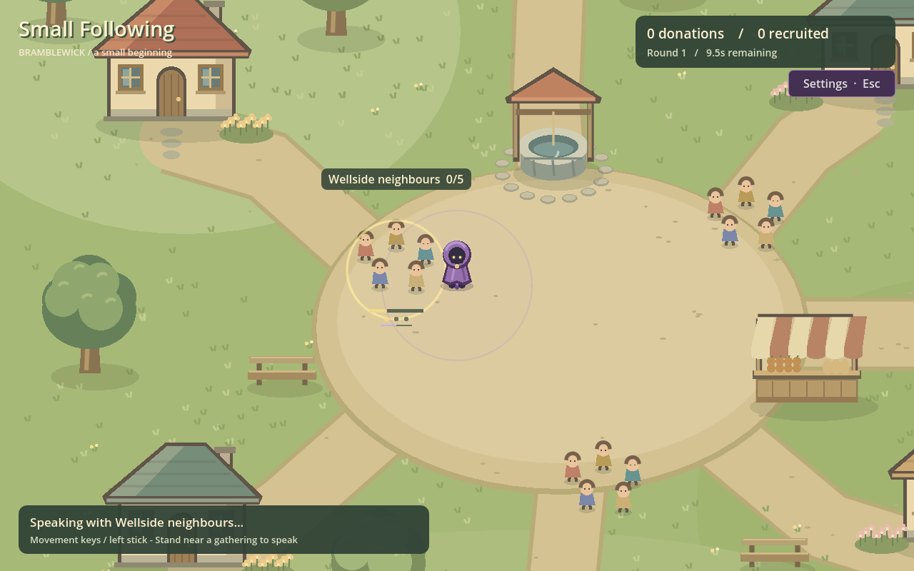
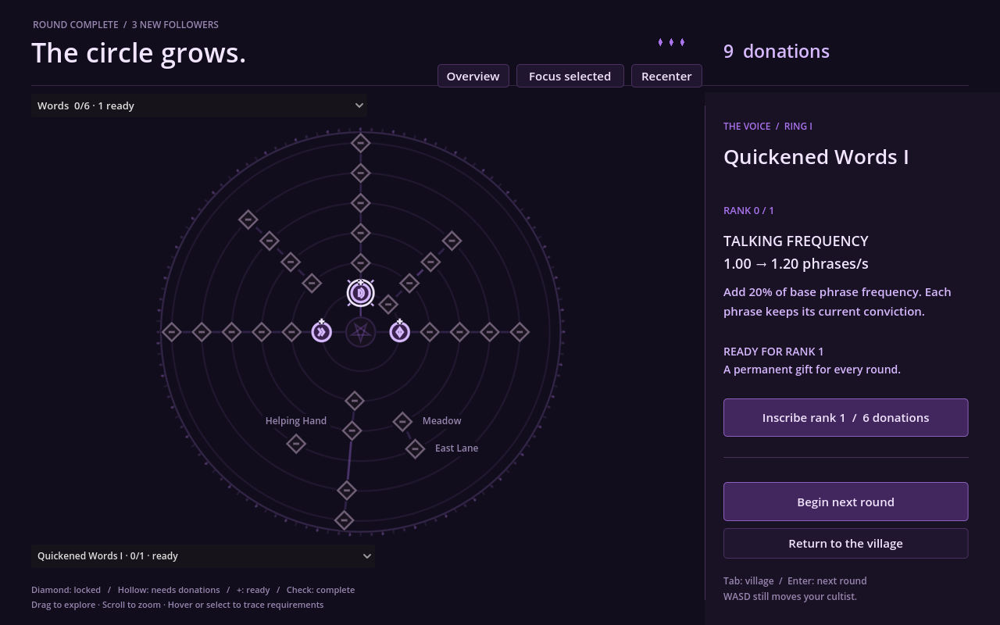

# Small Following

A small Godot prototype for a cute incremental game where **you are the robed cultist**: walk between village gatherings, speak, recruit and earn donations. Short rounds lead into a purple ritual-circle upgrade screen with 32 working nodes, 35 purchasable ranks and local progression saves. Art is procedural placeholder geometry; this is not a finished game.

## Run

Tested engine: **Godot 4.2.2.stable.mono.official.15073afe3**, using **GDScript** and **Compatibility** rendering. The Mono editor is installed here; the project contains no C# and requires no package installation.

Import `project.godot` in Godot, open `scenes/main.tscn`, and press **F6** (current scene) or **F5** (project). Or run directly in PowerShell:

```powershell
& 'C:\Program Files\Godot\Godot_v4.2.2-stable_mono_win64_console.exe' --path 'D:\WebHatchery\godot\small_following'
```

From the project folder, `.\Run.ps1` also launches the game; pass `-GodotExe '<installed executable>'` to use another local executable. On another machine, the equivalent is `godot --path <project-folder>`. Only the installed 4.2.2 build is the verified baseline. No software was installed.

| Action | Controls |
| --- | --- |
| Move the cultist | WASD / arrows / gamepad left stick |
| Speak | Stay within range of a gathering |
| Select an upgrade | Click its ritual node, or choose it in the node list below the graph |
| Find a branch | Branch selector above the graph (eight named branches) |
| Enlarge the selected upgrade | Focus selected button |
| Return to branch overview | Overview button (clears selection) |
| Pan the ritual | Left-drag empty graph space, or middle-drag |
| Zoom / restore view | Mouse wheel / Recenter button |
| Buy selected upgrade | U / Inscribe button / gamepad X (left face button) |
| Open the demo message after buying every rank | Click the lit ritual centre / Inner circle lit button |
| Dismiss the demo message | Keep playing / Esc; Tab returns to village, Enter starts another round |
| Return to village / reopen ritual | Tab between rounds, or the ritual's village button |
| Start next round | Enter / next-round button / gamepad A (bottom face button) |
| Mute / unmute all audio | M |
| Mute / unmute nonsense speech | V |
| Open / close settings | Settings button / Esc |
| Toggle fullscreen | Settings switch / F11 |
| Exit the desktop game | Settings → Exit Game |

Movement remains active during the ritual; Tab reveals the village between rounds. A new round returns the cultist to the starting entrance. Gamepad movement/action mappings exist but were not physically tested; graph selection and navigation currently require a mouse.

The branch selector shows owned nodes/total nodes and ready purchase counts for all eight branches. Smaller catalogs use branch buttons; the large test fixture also uses the selector. The node list includes every upgrade in the selected branch, including locked nodes, with rank and state; choosing one brings it into view. Overview clears selection and fits the whole graph; Recenter fits it while keeping the selected details. Hover previews prerequisite paths while the right panel keeps the selected upgrade's details.

## Current loop

- A 1560 x 1100 village with real actors, paths, props, collision footprints and camera.
- A directly movable purple cultist with normalized diagonal speed, world bounds and visibly trailing cloth.
- Three initial nonblocking gatherings of five listeners each, plus two purchasable gatherings, with local speech feedback and recruitment/donation events.
- **Provisional 11-second rounds**, tuned toward roughly three opening conversions through travel and conversation time. There is no three-recruit cap; [pacing evidence and assumptions](docs/PACING.md) explain the limit and upgraded comparisons.
- A large purple occult upgrade circle: 32 nodes across six rings, retaining second ranks on the three original tier-III nodes. Eight evenly spaced branch sectors fill the circle through gentle outward fans: Words above, Running left, Creed right, Merchants upper left, Trials upper right, and Village, Followers and Faith below. Quiet decoration, contextual prerequisite paths and shape/fill state cues support the existing rank details.
- Three distinct upgrade effects: initial talking ranks each add 20% of base phrase frequency, persuasion ranks add 0.5 conviction per phrase, and running ranks add 15% of base movement speed. The outer talking node's second rank adds 30% of base frequency. Initial node prices remain 6, 9 and 12 donations per branch; each outer node's second rank costs 18.
- Full ranks on the original nine nodes produce 1.9 phrases/second, 3 conviction/phrase and 288 pixels/second movement. The balance target is all 15 listeners across the three groups with a small positive margin on a competent route inside the unchanged 11-second round; [route evidence](docs/PACING.md) records actual timings and limitations.
- Versioned local progression retaining currency, purchased ranks, the recruitment-event total and round number. Existing single-purchase saves keep each old purchase as rank 1.

Base movement is 180 pixels/second. Speech within 105 pixels produces one phrase/second; each phrase adds one conviction, and three conviction recruits a listener for three donations. Extra conviction carries toward the next listener. Partial speech stays with its gathering until round end. A typical three-recruit opening earns nine donations, enough for one first-tier upgrade.

The original six inner nodes each have one rank and the original tier-III nodes each have two. Those twelve purchases cost 135 donations. Six new single-rank nodes add two gatherings and two further tiers each of talking and running, for 318 donations before the 30-donation helper (348 total). A previous node needs rank 1 to unlock its successor. One purchase action buys one rank, and stale selection requests cannot silently buy another. Two fully converted groups earn 30 donations, enough for a new 18-donation late rank; improving the route and speaking stats remains useful before a full village clear.

All audiences reset each round. The cumulative recruited total counts **recruitment events**, including the same villagers on later rounds; it is not a population of unique permanent followers. Restarting preserves progression but begins a fresh timer and audience state. No offline rewards or partial-round continuation are implemented.

The complete first-map catalog has 32 nodes and 35 ranks costing 1014 donations. The real catalog is `data/upgrades.json`. A separate **144-node validation fixture** exercises graph capacity and navigation; it is not additional purchasable game content. A second town, magic and production art remain future work. Browser and Windows exports use the [publishing workflow](docs/PUBLISHING.md).

Buying every rank in the current catalog lights the ritual's inner circle.
Click it, or the **Inner circle lit / Open** control below the graph, to see
**This is the end of the demo**. **Keep playing** or Esc dismisses the message;
movement, the village and further rounds remain available. Readiness is derived
from saved ranks, so a completed save lights the centre after reload. This is
independent of convincing the Priest. A future update will use this centre to
reach a new area's separate circle; no second area is implemented here.
[Completion scope and controls](docs/RITUAL_COMPLETION.md).

The outward spacing pass is an interim layout, not the accepted final art
direction. The requested redesign is a composed purple magical ritual seal:
coherent concentric rings, sigils and interlocking geometric motifs with the
existing upgrade nodes integrated into the composition. Decoration must stay
quiet and interactions and prerequisite paths clear. Redesign is pending
actual pixel inspection of the three new references; supported Windows
Library materialization remains blocked. The completed centre remains implemented.

## Audio

The promo's original instrumental score now plays quietly in the background,
continuing across rounds and ritual visits. Soft pitter-patter follows the
cultist's actual travel, including between rounds; standing still or pushing
into a wall is silent. Faster running increases footsteps within a cadence cap.
Short original synthetic nonsense syllables accompany completed player phrases,
including merchant and opponent conversations. One voice and a minimum gap keep
faster talking upgrades from stacking chatter or speeding up the samples.

**M** toggles all sound and **V** toggles speech alone. **Settings / Esc** opens
master, music, footsteps and speech volume sliders plus mute and fullscreen
switches. **F11** also toggles fullscreen. Preferences save automatically in
`user://settings.json`, separately from progression. Closing the page returns
to the village or ritual; movement and the round timer continue while open.
Between rounds, Tab closes settings and reveals the village. [Settings behavior
and storage](docs/SETTINGS.md). Speech timbre and mix
are provisional and need a human listening pass. [Asset provenance and rebuild
instructions](assets/audio/README.md). Run `tests/test_audio.gd` for isolated
audio behavior checks; a display run also checks real music playback/looping.

## Village expansion

Meadow Invitations adds five neighbours after Compelling Creed III. It opens Talking IV and Running IV; East Lane Invitations then adds another five listeners and opens tier V. Both stat paths also require their preceding tier. Before the finale upgrades, player stats reach 3 phrases/second, 3 conviction/phrase and 396 pixels/second. Groups appear after purchase and are recreated from saved ranks. Helping Hand costs 30 donations after Meadow Invitations. This small teal-robed helper walks around props at 150 px/s and uses three one-second phrases to recruit one listener, then finds another. It rests between rounds and resets at the entrance. Player upgrades affect the cultist; the helper keeps its own pace. Leave it an audience to work on: overtaking its targets can waste its effort. Prices and timing remain provisional; see [the scoped design](docs/VILLAGE_EXPANSION.md) and [route measurements](docs/PACING.md).

## Local saves

Progression is written to Godot's `user://progression.json`, normally beneath `%APPDATA%\Godot\app_userdata\Small Following` on Windows. Schema 2 stores purchased ranks; valid schema-1 saves migrate each existing purchase to rank 1 without changing coins, recruitment events or round number. Writes use a verified temporary file and prior-save backup. Invalid saves are validated/recovered with a visible notice; newer unsupported saves are preserved. A failed purchase save grants nothing and spends nothing. If saving earned donations fails, they remain in memory but may be lost on exit.

See [save fields and recovery rules](docs/ARCHITECTURE.md#local-progression-and-recovery) before changing IDs or schema. Test scripts isolate their saves from ordinary player progress. Runtime saves do not belong in this repository.

## Design and handoff

- [Godot development guide and documentation map](docs/GAME_DEVELOPMENT_GUIDE.md)
- [GDScript and scene standards](docs/CODE_STANDARDS.md)
- [UI composition and review](docs/UI_STYLE.md)
- [Approved ritual readability scope](docs/RITUAL_READABILITY.md)
- [Full ritual circle and demo completion](docs/RITUAL_COMPLETION.md)
- [Design proposal template](docs/GDD_TEMPLATE.md)
- [Commit message style](docs/COMMIT_STYLE.md)
- [Confirmed direction and provisional rules](docs/GAME_DESIGN.md)
- [Opening-round timing and route evidence](docs/PACING.md)
- [Visual direction and future asset needs](docs/VISUAL_DIRECTION.md)
- [Staged milestones](docs/MILESTONES.md)
- [Outstanding work only](TODO.md)
- [Architecture, upgrade data and save recovery](docs/ARCHITECTURE.md)
- [Guidance for future agents](AGENTS.md)
- [Exact verification results and environment limitations](docs/VERIFICATION.md)

## Actual rendered prototype

These captures come from the running scene with deterministic test setup; they are not supplied mockups or painted backgrounds.





Expansion evidence: [five gatherings](docs/verification/village-expanded.png), [helper speaking](docs/verification/helper-speaking.png), [helper inscription](docs/verification/ritual-helper.png) and [locked final tier](docs/verification/ritual-expansion-locked.png).

Readability evidence: [before the pass](docs/verification/ritual-readability-before.png), [branch overview after the pass](docs/verification/ritual-readability-overview.png), [East Lane prerequisites](docs/verification/ritual-readability-east.png), [hover preview](docs/verification/ritual-readability-hover.png), [purchase states](docs/verification/ritual-readability-states.png) and [large-fixture branch focus](docs/verification/ritual-fixture-branch.png). Cross-branch requirements appear when relevant to hover/selection; the fixed detail panel continues to name missing requirements.

Full-circle evidence: [incomplete ranks](docs/verification/ritual-demo-incomplete.png),
[lit centre](docs/verification/ritual-demo-ready.png),
[demo message](docs/verification/ritual-demo-message.png) and
[continued play after dismissal](docs/verification/ritual-demo-dismissed.png).

Additional evidence: [moving robe](docs/verification/starter-moving.png), [purchased node](docs/verification/ritual-purchased.png), [available second rank](docs/verification/ritual-rank-available.png), [maximum rank](docs/verification/ritual-rank-max.png), [full village conversion](docs/verification/village-full-clear.png), [next round](docs/verification/starter-next-round.png), and the test-only [144-node graph](docs/verification/ritual-144-fixture.png) and [focused distant node](docs/verification/ritual-fixture-focus.png). The large fixture demonstrates navigation; its nodes are not shipped upgrades.

## Supplied references: local transfer blocked

The two original village mockups remain unavailable locally because the supported Windows Library transfer helper fails at `os.setxattr`. Their pixels were not inspected on this executor. Intended destinations remain:

- `docs/reference/cultist-idle-village-closeup.png`
- `docs/reference/cultist-idle-village-overview.png`

Two new ritual-circle references were inspected by the parent agent in the cloud; this Windows implementation received their visual descriptions. Their originals are absent locally and their canonical filenames are unresolved here. The ritual is independently authored from those descriptions in the requested violet/lilac palette; no local pixel matching is claimed. [Reference IDs, provenance and recovery](docs/reference/README.md).

## Checks

From the project folder:

```powershell
$godotExe = 'C:\Program Files\Godot\Godot_v4.2.2-stable_mono_win64_console.exe'
& $godotExe --headless --path . --import
& $godotExe --headless --path . --script res://tests/test_progression.gd
& $godotExe --headless --path . --script res://tests/smoke_test.gd
& $godotExe --headless --path . --script res://tests/test_ritual_readability.gd
& $godotExe --headless --path . --script res://tests/test_demo_completion.gd
& $godotExe --headless --fixed-fps 60 --path . --script res://tests/test_pacing.gd
& $godotExe --headless --fixed-fps 60 --path . --script res://tests/test_helper.gd
& $godotExe --headless --fixed-fps 60 --path . --script res://tests/test_merchants.gd
& $godotExe --headless --fixed-fps 60 --path . --script res://tests/test_encounters.gd
& $godotExe --fixed-fps 60 --path . --script res://tests/capture_starter.gd -- "--capture-dir=$PWD\docs\verification"
```

The tests cover movement/cloth/collision, speech timing, round transitions, distinct rank effects, purchase guards, old-save migration and local-save validation/recovery. The readability suite exercises branch sectors, prerequisite ancestry, hover versus selection, navigation and transformed graph picking; rendered inspection checks the actual layout. The completion suite covers catalog-derived readiness, final-rank purchase, saved-rank reload, centre activation and dismissal independently of priest victory. Route tests drive the real scene at a fixed simulated timestep and count complete individual conversions, including full-rank completion time and remaining margin. Captures require a rendering display; headless tests cannot verify pixels. Human movement feel, pacing and large-graph navigation still need playtesting.

Exact latest check counts, rendered inspection results and commands are recorded in [VERIFICATION.md](docs/VERIFICATION.md). The installed Mono build previously returned an `_EDITOR_GET` / `EditorSettings` error during headless editor import and exit 1 during automatic shutdown without a runtime diagnostic. Keep those environment results separate from successful script/runtime tests; do not describe import as clean unless a new run establishes that.

## Publishing

`.\publish.ps1` exports Web and Windows and deploys to WebHatchery preview.
Use `-Production` (`-p`) for local production, `-FTP` for live WebHatchery,
or `-BuildOnly` to prepare artifacts. `-DryRun` makes no changes.
Then `.\publish-itch.ps1` uploads both builds to
[Small Following on itch.io](https://kalaith.itch.io/small-following).
Its `-Preview` compares changes without uploading; `-Status` checks channels.

See [publishing setup, flags and hosting requirements](docs/PUBLISHING.md).
The approved standard Godot 4.2.2 editor exports the game; `Run.ps1` retains
the original Mono editor. Runtime saves stay separate from packaged files.

## Local promo video

The 72-second [Small Following promo](exports/promo/Small_Following_Promo.mp4)
combines 51 seconds of actual staged prototype gameplay with 21 seconds of
original illustrated title sequences and an original instrumental score.
The local MP4 is 1920 x 1080 at 30 fps, with H.264 video and stereo AAC audio.
Generated media stays in ignored `exports/promo/`; it is not included in Git.
[Production notes and reproduction commands](tools/promo/README.md) explain
isolated capture, prepared upgrade builds, artwork provenance and verification.

## Merchants

Merchant Invitations adds two distinct hat-and-purse NPCs near the market after Meadow Invitations. Each needs 9 conviction and gives 12 donations. Fair Bargain and Trusted Patron each add 1.5 merchant-only conviction per phrase; Generous Purses adds 6 donations per merchant. The helper uses the higher threshold with its own unchanged stats. The original village route is unchanged. See [first-map scope](docs/FIRST_MAP.md).

Merchants have no permanent payout label. Each recruitment briefly shows its
numeric donation above the listener, then rises and fades away. This includes
helper recruits and opponent victories; larger rewards stay as digits.
[Rendered reward examples](docs/verification/recruitment-rewards.png).

## Completing Bramblewick

Buy **Town Debate** after East Lane Invitations. Each new round brings the next
opponent along the east path into the town center: **Skeptic → Town Guard → Zealot
→ Priest**. Stand within speaking range after arrival to convince them. The Guard
rebuts two opening phrases; the Zealot loses conviction while unattended. The
Priest has three objections, loses conviction when left alone, and requires 240
conviction. Failed attempts retry next round. Each victory advances saved progress.

The Trials and Faith branches add targeted conviction. Creed IV/V, Words VI and
Running VI remain distinct general upgrades. At full ranks, the cultist has 3.5
phrases/s, 5 base conviction/phrase and 432 px/s movement; specialist effects raise
merchant conviction to 8 and Priest conviction to 14. The practical scripted boss
route wins in 9.133 seconds with 1.867 seconds left; incomplete and late routes fail.
These values remain provisional until human playtesting.

Convincing the Priest saves **Bramblewick complete**. Village rounds, direct movement
and remaining purchases stay available afterwards. Buying every catalog rank separately
lights the demo-completion centre; neither condition grants the other. Further maps await
future implementation through that centre and a separate area circle.
Older saves start with no opponents defeated and retain all existing progression.

[Priest encounter](docs/verification/opponent-priest.png) ·
[Completed ritual circle](docs/verification/ritual-map-complete.png) ·
[Encounter rules and scope](docs/FIRST_MAP.md)
